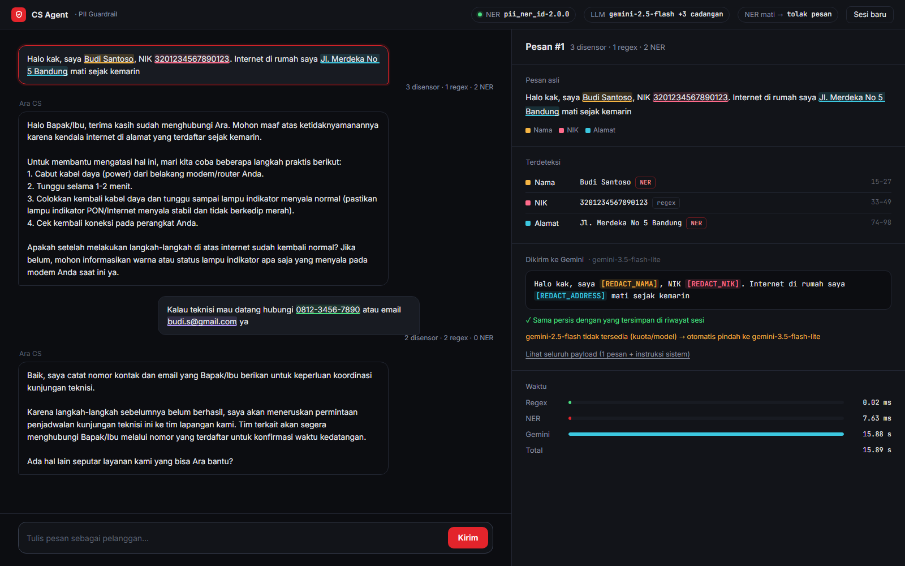

# AI Agent Customer Support dengan PII Guardrail

AI Agent customer support berbasis **Google ADK + Gemini 2.5 Flash** yang tidak pernah
mengirim data pribadi pelanggan ke LLM, dan tidak menyimpannya di riwayat sesi.
Setiap pesan melewati dua lapis deteksi:

1. **Regex** → NIK, email, nomor telepon
2. **Model NER buatan sendiri** (spaCy, dilatih dengan data kita + fitur word vectors) → nama & alamat,
   berjalan sebagai **service REST terpisah**

**Hasil utama:** pada evaluasi end-to-end (20 chat campuran, 29 item PII), **29 tertutup,
0 bocor**, 1 kata non-PII ikut tersensor. Model NER di test set buta terbaru (test_v6, fokus
nama hari & bulan): F2 0.82 dan **20 dari 20 kalimat tanpa PII tetap utuh** — salah sensor
yang mengganggu di versi sebelumnya (`Sabtu`, `Agustus` dianggap nama) hilang. Yang masih
kurang: beberapa alamat tanpa awalan "Jl." lolos, lihat [Keterbatasan](#keterbatasan-yang-disadari).



Halaman demo menunjukkan, untuk setiap pesan: PII yang terdeteksi di pesan asli (diwarnai
per jenis, beserta lapis yang menangkapnya), **teks persis yang dikirim ke Gemini** (diambil
dari `llm_request` di `before_model_callback`), bukti bahwa teks itu sama dengan yang tersimpan
di riwayat sesi, model yang menjawab, dan waktu tiap tahap. Server tidak pernah mengirim balik
nilai PII, hanya posisinya. Pewarnaan dilakukan di browser dari teks yang diketik pengguna.

## Arsitektur

```
┌──────┐ pesan asli ┌───────────────────────────── AI Agent (Google ADK) ─────────────────────────────┐
│ User │ ─────────► │ ① PiiRedactionPlugin.on_user_message_callback   (pintu masuk SESI)              │
└──────┘            │      regex + NER → pesan disimpan ke riwayat sesi SUDAH tanpa PII               │
    ▲               │ ② before_model_callback                          (pintu masuk LLM, syarat soal) │
    │               │      1. regex : NIK / email / telepon  → [REDACT_NIK] ...                       │
    │               │      2. HTTP POST /ner ──────────────►  NER Service (FastAPI + spaCy)           │
    │               │         ◄──── entities PERSON/ADDRESS ── model dilatih sendiri, 40 MB           │
    │               │      3. ganti span → [REDACT_NAMA] / [REDACT_ADDRESS]                           │
    │               │                  │ teks bersih                                                  │
    │               │                  ▼                                                              │
    │               │            Gemini 2.5 Flash                                                     │
    │   jawaban     │ ③ after_model_callback                           (pintu KELUAR)                 │
    └───────────────┤      token [REDACT_*] yang dibeo LLM → "alamat yang Bapak/Ibu berikan"          │
                    └─────────────────────────────────────────────────────────────────────────────────┘
```

### Alur integrasi satu giliran chat
1. **Plugin ①** menyensor pesan user **sebelum** ADK menyimpannya ke riwayat sesi.
   Memori server tidak pernah memegang PII mentah.
2. ADK menyusun `llm_request` dari seluruh riwayat sesi.
3. **`before_model_callback` ②** memeriksa **setiap** pesan ber-role `user` sekali lagi, tepat
   sebelum dikirim ke Gemini. Ini *defense in depth*: ia tetap menjaga jalur yang tidak lewat
   plugin (misalnya runner tanpa plugin, atau pesan yang disuntikkan langsung ke sesi). Hasil
   per pesan di-cache (kunci = hash), jadi teks yang sudah bersih tidak dikirim ulang ke NER.
4. Di kedua titik, **regex dijalankan lebih dulu**, sehingga NIK/email/telepon sudah hilang
   sebelum teks dikirim lewat jaringan ke NER Service.
5. Agent memanggil `POST {NER_SERVICE_URL}/ner` (timeout 2 detik), membuang tebakan yang tidak
   masuk akal (PERSON tanpa huruf), lalu mengganti span dari belakang ke depan supaya offset
   tidak bergeser.
6. Teks bersih diteruskan ke Gemini, dan jawabannya dirapikan oleh **`after_model_callback` ③**.
7. **Fail-closed:** jika NER Service mati, plugin menyimpan `[PESAN DITAHAN…]` alih-alih teks
   mentah, dan callback mengembalikan `LlmResponse` penolakan sehingga Gemini **tidak dipanggil**.
   Bisa diubah dengan `GUARDRAIL_FAIL_MODE=open` (regex saja).

### Kenapa bentuknya begini
| Keputusan | Alasan |
|---|---|
| Guardrail di callback, bukan di tool | Tool dipanggil atas kehendak LLM, artinya LLM sudah membaca PII-nya. Callback berjalan sebelum request dikirim. |
| Plugin **dan** `before_model_callback` | Plugin menjaga penyimpanan, callback menjaga LLM. Kalau salah satu terlewat, yang lain masih berjaga. |
| Regex untuk NIK/email/telepon, NER untuk nama/alamat | Bentuk yang pasti lebih murah dan akurat dengan aturan. Nama dan alamat tidak punya bentuk tetap, jadi perlu model yang belajar dari konteks kalimat. |
| NER sebagai service terpisah | Siklus rilis dan profil resource berbeda dari agent. Bisa di-scale dan di-retrain sendiri, dan bisa dipakai sistem lain lewat kontrak API yang sama. |
| Model dipilih dengan **F2** (recall ×2) | FN = data bocor ke pihak ketiga, FP = jawaban kurang personal. Dampaknya asimetris. |
| Log & metrik hanya berisi **angka** | Log tidak boleh menjadi tempat bocor baru. |

## Menjalankan

Prasyarat: Python 3.12, API key Gemini dari [Google AI Studio](https://aistudio.google.com/apikey).
Docker **tidak** diperlukan untuk menjalankan di laptop.

```powershell
python -m venv .venv
.venv\Scripts\pip install -r ner_service\requirements.txt -r agent\requirements.txt pytest psutil

# 1) NER Service
.venv\Scripts\python -m uvicorn app:app --app-dir ner_service --port 8020

# 2) Agent + halaman demo (terminal lain)
$env:GOOGLE_API_KEY = "<api-key>"
$env:NER_SERVICE_URL = "http://127.0.0.1:8020"
.venv\Scripts\python -m uvicorn server:app --app-dir agent --port 8021
# buka http://127.0.0.1:8021   (tambah ?auto=1 untuk mengirim 2 contoh otomatis)

# Alternatif: UI developer bawaan ADK, atau demo di terminal
.venv\Scripts\adk web --port 8022 agent        # run pertama bertanya soal telemetry
.venv\Scripts\python scripts\demo_chat.py
```

Test & evaluasi (tanpa API key; Gemini & NER Service di-mock / dimuat in-process):
```powershell
.venv\Scripts\python -m pytest                       # 48 test, termasuk 4 test browser (Edge/Chromium)
.venv\Scripts\python scripts\eval_guardrail.py       # kebocoran PII end-to-end
cd ner_service; ..\.venv\Scripts\python evaluate.py  # akurasi model NER
```

Melatih ulang model (opsional — model terlatih sudah ikut di repo):
```powershell
.venv\Scripts\python ner_service\prepare_vectors.py   # sekali: unduh fastText (~1,2 GB) & pangkas jadi ~40 MB
.venv\Scripts\python ner_service\data\generate_train.py
.venv\Scripts\python ner_service\train.py
.venv\Scripts\python ner_service\sweep.py --workers 4 # opsional: banyak konfigurasi x seed, dipilih di val
```
`prepare_vectors.py` menulis ke `.cache/` (tidak ikut git). Menjalankan service **tidak**
butuh langkah ini: vektor yang dipakai sudah tersimpan di dalam `ner_service/model/`.

Dengan Docker: `docker compose up --build`, lalu buka http://127.0.0.1:8021.

**Kuota Gemini.** Free tier dihitung per model, dan `gemini-2.5-flash` hanya 20 request/hari
saat diuji. Agent memakai [`FallbackGemini`](agent/cs_agent/model.py): kalau model utama
mengembalikan 429/503/404, agent otomatis pindah ke model cadangan (`GEMINI_FALLBACK_MODELS`,
default `gemini-3.5-flash-lite, gemini-3.5-flash, gemini-flash-latest`). Model yang benar-benar
menjawab ditampilkan di panel bukti.

## Guardrail 1 — Regex

| PII | Pola | Placeholder |
|---|---|---|
| NIK | `(?<!\d)(?:\d{4}[ .-]?\d{4}[ .-]?\d{4}[ .-]?\d{4}\|\d{6}[ .-]\d{6}[ .-]\d{4})(?!\d)` | `[REDACT_NIK]` |
| Email | `[A-Za-z0-9._%+-]+@[A-Za-z0-9-]+(?:\.[A-Za-z0-9-]+)*\.[A-Za-z]{2,}` | `[REDACT_EMAIL]` |
| Telepon | `(?<!\d)(?:\+62\|62\|0)[\s-]?8[1-9](?:[\s-]?\d){6,10}(?!\d)` | `[REDACT_PHONE]` |

Perbaikan terhadap pola baseline di soal:
- **NIK** `^[0-9]{16}$`: anchor `^…$` membuatnya hanya cocok bila **seluruh pesan** adalah NIK.
  Diganti *lookaround* `(?<!\d)…(?!\d)` ("kiri-kanan bukan angka"), sehingga NIK di tengah
  kalimat tertangkap dan angka 20 digit tidak terpotong jadi NIK palsu. `\b` tidak dipakai
  karena huruf dihitung bagian kata, sehingga `…0123ya` akan lolos. Juga menangkap penulisan
  berkelompok (`3201 2345 6789 0123`, `320123 456789 0123`). Struktur NIK sengaja **tidak**
  divalidasi: salah ketik satu digit akan lolos, dan untuk guardrail recall lebih penting.
- **Email**: titik sebelum TLD tidak di-escape (`.` = karakter apa pun) → `\.`.
- **Telepon** `(+62|62|0)…`: `+` tidak di-escape, sehingga Python langsung error
  `nothing to repeat`. Ditambah dukungan format `0812-3456-7890` dan `+62 812 …`.
- **Urutan**: NIK → email → telepon. Email harus lebih dulu dari telepon supaya
  `081234567890@gmail.com` tertangkap utuh sebagai email.

## Guardrail 2 — NER (model buatan sendiri)

- **Model**: tokenizer `id` + komponen `ner` spaCy. Bobot NER dilatih **dari nol** dengan data kita;
  sejak v6 ditambah word vectors fastText Bahasa Indonesia (20 ribu kata) sebagai **fitur**, supaya
  model tahu "apakah" atau "status" adalah kata umum, bukan nama. Kata umum di tepi tebakan nama
  dipangkas oleh [`postprocess.py`](ner_service/postprocess.py).
  Label `PERSON` → `[REDACT_NAMA]`, `ADDRESS` → `[REDACT_ADDRESS]`. Detail: [docs/MODEL_CARD.md](docs/MODEL_CARD.md).
- **Data latih**: 4.000 kalimat sintetis (49 template chat CS × nama lintas daerah × alamat
  berbagai format, ditambah kalimat curhat/keluhan tanpa PII dan nominal rupiah). Sintetis
  karena chat pelanggan asli tidak boleh dipakai.
- **Data uji ditulis tangan**, dengan nama dan alamat yang tidak ada di data latih:

| Set | Peran |
|---|---|
| `val.jsonl` | memilih epoch (F2) |
| **`test_v6.jsonl`** | **buta** (v8): nama hari & bulan, dikunci sebelum data/latih diubah, dievaluasi sekali |
| `test_v5.jsonl` | buta untuk v7 (posisi nama & alamat tanpa awalan), kini pembanding |
| `test_v4.jsonl` | buta untuk v6 (kalimat tanya CS), kini pembanding |
| `test_v3.jsonl` | buta untuk v5 (kalimat curhat), kini pembanding |
| `test_v2.jsonl` | buta untuk v4, kini pembanding |
| `test.jsonl` (v1) | terkontaminasi (dilihat di iterasi awal), hanya pembanding |

**Hasil model `pii_ner_id-3.2.0`** (dipilih dari sweep 12 konfigurasi × 3–8 seed, semuanya di val):

| Set | Precision | Recall | F1 | F2 | Recall longgar* | Kalimat tanpa PII tetap bersih |
|---|---|---|---|---|---|---|
| **test_v6 (buta)** | **0.89** | **0.80** | **0.84** | **0.82** | **0.90** | **20/20** |
| test_v5 | 0.96 | 0.96 | 0.96 | 0.96 | 0.96 | 20/20 |
| test_v4 | 1.00 | 0.80 | 0.89 | 0.83 | 0.80 | 18/18 |
| test_v3 | 0.86 | 1.00 | 0.92 | 0.97 | 1.00 | 18/20 |
| test_v2 | 1.00 | 1.00 | 1.00 | 1.00 | 1.00 | 5/5 |
| val (74 kalimat) | 1.00 | 0.98 | 0.99 | 0.98 | 0.98 | 36/36 |

\* entity yang setidaknya tersentuh tebakan berlabel sama. Perjalanan enam iterasi, sebaran
antar-seed, dan kenapa seed yang skornya lebih bagus **di test** justru tidak dipilih:
[docs/ner-iterasi.md](docs/ner-iterasi.md). Ringkasan alur kerja: [docs/ALUR-JOURNEY.md](docs/ALUR-JOURNEY.md).

**Temuan metodologi:** model versi sebelumnya (v3) mendapat F1 0.86 di test_v1, tetapi hanya
**0.69 di test_v2 yang buta**. Selisih itu bukti terukur *test-set leakage*: test set yang
dilihat berulang kali ikut memengaruhi keputusan, sehingga skornya menipu. Sejak itu, model
dipilih dengan val dan test disentuh sekali saja. Lengkapnya di
[docs/ner-iterasi.md](docs/ner-iterasi.md) dan [docs/ner-evaluation.md](docs/ner-evaluation.md).

### API NER Service
```http
POST /ner
{"text": "Nama saya Budi Santoso dan tinggal di Jalan Sudirman Jakarta"}

200 OK
{
  "entities": [
    {"label": "PERSON",  "text": "Budi Santoso",           "start": 10, "end": 22},
    {"label": "ADDRESS", "text": "Jalan Sudirman Jakarta", "start": 38, "end": 60}
  ],
  "model_version": "pii_ner_id-2.1.0",
  "latency_ms": 1.3
}
```
- `GET /health`: readiness/liveness probe Kubernetes.
- `GET /metrics/`: metrik Prometheus (`ner_requests_total`, `ner_inference_seconds`,
  `ner_entities_total{label}`, `ner_text_chars`). Hanya angka, tidak ada isi teks.

## Evaluasi end-to-end: berapa PII yang sampai ke LLM?

Akurasi model bukan pertanyaan terpenting. Yang terpenting adalah **apa yang lolos lewat
sistem lengkap**. [`scripts/eval_guardrail.py`](scripts/eval_guardrail.py) menjalankan
pipeline regex → NER → redaksi pada 20 chat campuran yang memuat semua jenis PII, ditambah
jebakan yang mirip PII (nominal `Rp1508000`, order ID 20 digit, nama kota):

| Jenis | Lapis | Item | Tertutup | Sebagian | Bocor utuh |
|---|---|---|---|---|---|
| NIK | regex | 4 | 4 | 0 | 0 |
| Email | regex | 3 | 3 | 0 | 0 |
| Telepon | regex | 4 | 4 | 0 | 0 |
| Nama | NER | 10 | 10 | 0 | 0 |
| Alamat | NER | 8 | 8 | 0 | 0 |
| **Total** | | **29** | **29 (100%)** | **0** | **0** |

Over-redaction: 2 kata non-PII ikut tersensor (`pending`, `merah`, ditebak PERSON oleh model).
Sengaja **tidak** ditambal dengan contoh khusus, karena itu sama dengan menyontek set evaluasi.
Detail: [docs/guardrail-evaluation.md](docs/guardrail-evaluation.md).

## Contoh input-output (hasil nyata `scripts/demo_chat.py`)

| Giliran | Pesan user | Yang dikirim ke Gemini **dan** disimpan di sesi |
|---|---|---|
| 1 | Halo kak, nama saya Budi Santoso, NIK 3201234567890123. Internet di rumah saya Jalan Sudirman No. 10 Jakarta mati sejak kemarin. | Halo kak, nama saya [REDACT_NAMA], NIK [REDACT_NIK]. Internet di rumah saya [REDACT_ADDRESS] mati sejak kemarin. |
| 2 | Kalau mau dihubungi teknisi, nomor saya 0812-3456-7890 atau email budi.s@gmail.com | Kalau mau dihubungi teknisi, nomor saya [REDACT_PHONE] atau email [REDACT_EMAIL] |
| 3 | Oke, tadi alamat saya yang mana ya kak? | Oke, tadi alamat saya yang mana ya kak? *(tanpa PII, tidak diubah)* |

Jawaban agent:
> **1:** Halo Bapak/Ibu, saya Ara CS. Mohon maaf atas ketidaknyamanan yang Bapak/Ibu alami
> terkait gangguan internet di alamat yang Bapak/Ibu berikan. […]
>
> **3:** Mohon maaf, Bapak/Ibu. Untuk menjaga keamanan dan kerahasiaan data pribadi Bapak/Ibu,
> kami tidak dapat menampilkan kembali detail alamat di percakapan ini.

## Resource & performance

Diukur dengan [`benchmark/bench_ner.py`](benchmark/bench_ner.py) (1.000 request per skenario
setelah warm-up). Detail dan spesifikasi mesin ada di [docs/resource-performance.md](docs/resource-performance.md).

| | Nilai |
|---|---|
| Ukuran model | 40 MB (termasuk 20 ribu word vectors) |
| Memory proses NER Service | ~249 MB RSS (model + vektor ~150 MB) |
| Latency model, teks ~60 / ~200 / ~1.000 karakter | p50 2,1 / 3,9 / 12,7 ms — p95 3,0 / 5,2 / 16,2 ms |
| Latency HTTP `POST /ner`, teks ~60 / ~200 / ~1.000 karakter | p50 4,7 / 6,5 / 14,1 ms |
| CPU saat beban penuh | ~1 core (inferensi single-thread) |

Overhead guardrail hanya milidetik, dibanding 1,5–4 detik untuk satu panggilan Gemini.

## Deployment (GKE)

- `ner_service/Dockerfile`, `agent/Dockerfile`: python-slim, non-root. Model di-bake ke image.
- Image dibangun dengan **Cloud Build**, jadi tidak perlu Docker di laptop.
- `k8s/`: namespace `pii-guard`. NER = Deployment 2 replika + Service **ClusterIP** + probe
  `/health` + `PodMonitoring` (Managed Prometheus). Agent = Deployment + Service ClusterIP.
  API key disimpan di **Secret**. Resource requests/limits diambil dari hasil benchmark.
- Langkah lengkap: [docs/DEPLOY-GKE.md](docs/DEPLOY-GKE.md).

## CI

[`.github/workflows/ci.yml`](.github/workflows/ci.yml):
1. pytest (42 test: regex, plugin & callback dengan mock, fallback model, kontrak API, metrik, server)
2. **Gerbang kebocoran**: `eval_guardrail.py` harus menghasilkan **0 PII bocor utuh**.
   Model baru yang membuat PII bocor tidak bisa lolos.
3. **Test browser** (Playwright + Chromium): mengetik di halaman demo dan memeriksa PII diwarnai,
   payload ke LLM bersih, dan fail-closed saat NER mati. Gemini diganti LLM palsu
   (`CS_AGENT_FAKE_LLM=1`), jadi tidak butuh API key dan tidak memakai kuota.
4. Build kedua Dockerfile.

## Keterbatasan yang disadari

- **Ukuran uji kecil**: sekitar 20 kalimat per set, satu entity ≈ 5%. Angka di atas adalah
  indikasi, bukan bukti statistik. Train, val, dan test ditulis pihak yang sama, sehingga bisa
  ada bias gaya. Uji paling jujur adalah chat pelanggan asli yang sudah dianonimkan.
- **NER**: beberapa **alamat tanpa awalan "Jl."** (`cibaduyut bandung selatan`) masih lolos —
  ini kekurangan utama model sekarang; batas alamat yang langsung disambung keterangan waktu
  kadang kelebihan. Sebaran antar-seed lebar, dan val belum memuat cukup contoh alamat tanpa
  awalan untuk bisa memilih seed berdasarkan risiko itu (rencana v9 di
  [ner-iterasi.md](docs/ner-iterasi.md)).
- **Regex**: telepon rumah dan email yang disamarkan (`budi [at] gmail`) tidak tertangkap.
- **Entity lain** belum ditangani: nomor rekening, tanggal lahir, plat nomor.
- **Agent 1 replika**: sesi disimpan di memori pod; scale-out butuh session store bersama.

## Struktur repo

```
agent/cs_agent/            agent ADK (app + plugin + FallbackGemini) + guardrails/ (regex_pii, ner_client, callback)
agent/server.py, web/      halaman demo + API chat yang mengembalikan jejak guardrail
ner_service/               app.py (FastAPI), train.py, evaluate.py, postprocess.py, data/, model/
ner_service/prepare_vectors.py, sweep.py   siapkan word vectors; sweep konfigurasi x seed
benchmark/bench_ner.py     pengukuran CPU / memory / latency
scripts/                   demo_chat.py, eval_guardrail.py (+ dataset)
k8s/                       manifest Kubernetes + PodMonitoring
tests/                     pytest
docs/                      PRD, model card, evaluasi NER & guardrail, iterasi, resource, deploy
.github/workflows/ci.yml   CI + gerbang kebocoran
```
